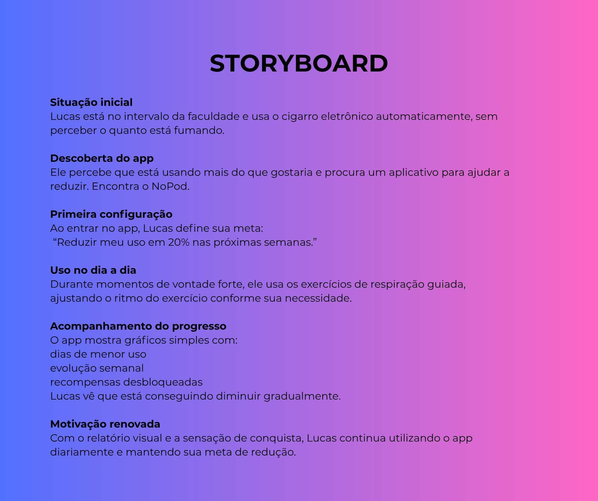
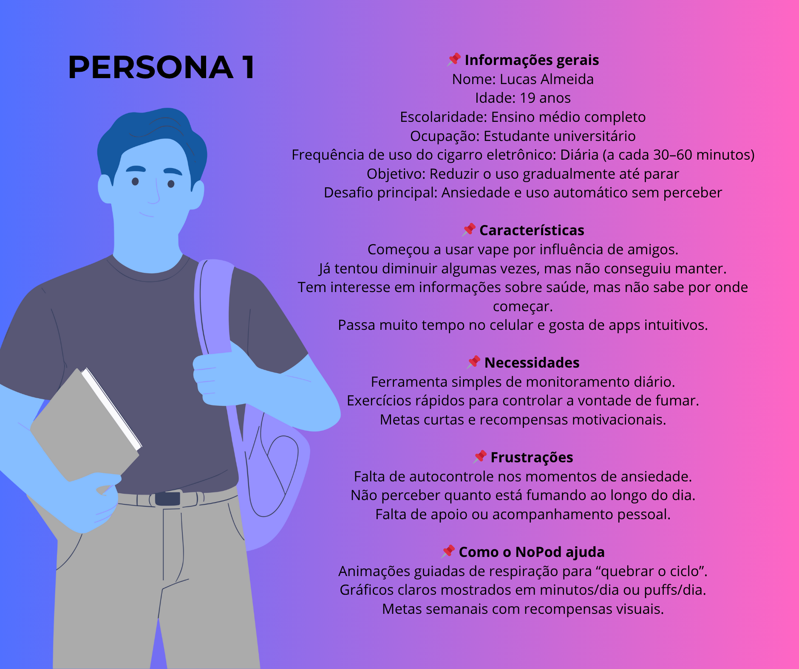
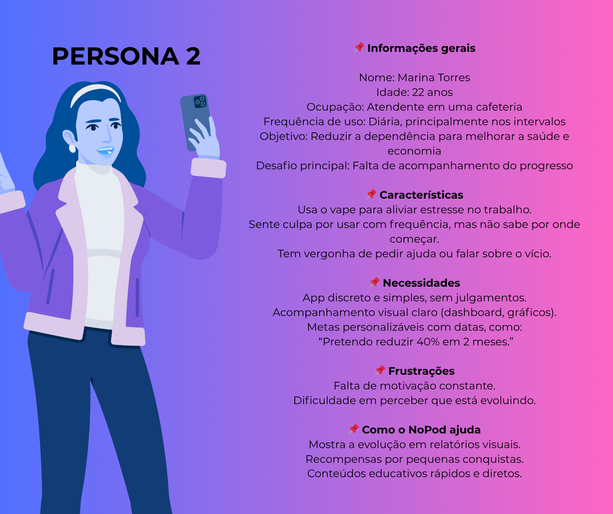

<p align="center">
  
</p>

# 📱 NoPod – Aplicativo para Ajudar a Parar o Uso do Cigarro Eletrônico

Repositório oficial do projeto desenvolvido para a disciplina **Projeto Interdisciplinar I** do curso de **Gestão da Tecnologia da Informação – IFPR Campus Pinhais**.

---

# 1. Identificação

### 🔹 Identidade visual

A identidade visual do projeto NoPod está representada pelo logotipo disponível no topo deste README e nos arquivos do repositório.

### 🔹 Equipe

| Nome                             | Papel                                         | Responsabilidades                                                                                                                                               |
| -------------------------------- | --------------------------------------------- | --------------------------------------------------------------------------------------------------------------------------------------------------------------- |
| **Arthur Mendes de Vasconcelos** | Product Owner, UX/UI Designer e Desenvolvedor | Concepção do produto, prototipação, definição da experiência do usuário, desenvolvimento das telas, implementação das funcionalidades e integração com Firebase |

### 🔹 Forma de comunicação

* Organização das tarefas por meio de ferramentas digitais de apoio ao projeto;
* Registro das decisões e avanços no repositório do GitHub;
* Acompanhamento das etapas de desenvolvimento conforme a evolução do projeto.

---

# 2. Concepção

### 🔹 Visão geral

O NoPod é um aplicativo mobile desenvolvido para auxiliar usuários que desejam reduzir ou abandonar o uso de cigarros eletrônicos. O projeto busca oferecer ferramentas simples e acessíveis que auxiliem no enfrentamento da vontade de fumar, incentivando hábitos mais saudáveis por meio do acompanhamento da jornada do usuário.

### 🔹 Objetivo

Oferecer uma ferramenta digital que auxilie usuários no processo de redução ou abandono do uso de cigarros eletrônicos, promovendo conscientização e acompanhamento da evolução individual.

### 🔹 Escopo do Produto

**Descrição:**

Aplicativo mobile desenvolvido com React Native e Firebase, permitindo o cadastro e autenticação de usuários, acompanhamento da jornada de resistência ao uso do cigarro eletrônico e acesso a ferramentas de apoio durante o processo de cessação.

### Funcionalidades Implementadas

* ✅ Cadastro de usuários;
* ✅ Login de usuários;
* ✅ Recuperação de senha;
* ✅ Cadastro de nome/apelido;
* ✅ Tela inicial personalizada;
* ✅ Exercício guiado de respiração;
* ✅ Registro de resistências ao cigarro eletrônico;
* ✅ Jornada do usuário com acompanhamento da evolução.

### Funcionalidades Futuras

* 🚧 Metas personalizadas;
* 🚧 Sistema de recompensas;
* 🚧 Perfil do usuário;
* 🚧 Tela informacional sobre cigarros eletrônicos.

### 🔹 Principais Entregas

* MVP funcional desenvolvido em React Native;
* Integração com Firebase Authentication;
* Integração com Cloud Firestore;
* Exercício de respiração guiado;
* Sistema de registro de resistências;
* Jornada do usuário;
* Estrutura preparada para futuras funcionalidades.

### 🔹 Critérios de Aceite

* Usuário consegue criar uma conta e realizar login;
* Usuário consegue recuperar sua senha;
* O aplicativo registra corretamente as resistências ao uso do cigarro eletrônico;
* O exercício de respiração executa sem falhas;
* Os dados do usuário são armazenados corretamente no Firebase;
* A jornada do usuário apresenta as informações registradas sem inconsistências.

---

# 3. Design do Software

### 🔹 Design Centrado no Usuário

O desenvolvimento do NoPod foi baseado nos princípios do Design Centrado no Usuário (DCU), buscando compreender as necessidades, dificuldades e expectativas do público-alvo. Para isso, foi realizado um formulário de pesquisa com potenciais usuários, permitindo identificar hábitos relacionados ao uso de cigarros eletrônicos e possíveis funcionalidades de apoio para o processo de redução ou abandono do consumo.

**Formulário utilizado:** https://forms.gle/2Wo5ryF5x1nNVgA8A

### 🔹 Personas

As personas representam os perfis de usuários considerados durante o desenvolvimento do NoPod, auxiliando na definição das funcionalidades e na construção de uma experiência alinhada às necessidades do público-alvo.

### 🔹 Mapa de Empatia

O mapa de empatia foi utilizado para compreender melhor as necessidades, sentimentos, desafios e expectativas dos usuários em relação ao processo de redução do uso de cigarros eletrônicos. Essa ferramenta auxiliou na definição das funcionalidades e na construção da experiência do usuário dentro do aplicativo.

### 🔹 Storyboard

O storyboard foi desenvolvido para representar visualmente o contexto de utilização do aplicativo, demonstrando situações do cotidiano em que o usuário pode recorrer ao NoPod como ferramenta de apoio durante momentos de vontade de fumar.

### 🔹 Guia de Estilo (UI Design)

A interface do NoPod foi desenvolvida com foco em simplicidade, clareza e facilidade de uso. A identidade visual utiliza predominantemente tons de azul, transmitindo sensação de tranquilidade e confiança. Os elementos seguem um padrão consistente, com botões intuitivos, tipografia legível e navegação objetiva, proporcionando uma experiência agradável ao usuário.

### 🔹 Prototipação do MVP

O protótipo do MVP foi desenvolvido utilizando a ferramenta Figma, permitindo a validação da navegação, organização das telas e experiência do usuário antes da implementação.

O protótipo contempla as principais funcionalidades do aplicativo, incluindo:

* Tela de Login;
* Tela de Cadastro;
* Recuperação de Senha;
* Cadastro de Nome/Apelido;
* Tela Inicial;
* Exercício de Respiração;
* Tela de Parabéns;
* Jornada do Usuário.

**Protótipo Figma:** https://www.figma.com/proto/EdQdXCP4n99fCRMnscNMli/NoPod?node-id=0-1&t=zsj3O5a35omWvt68-1

<p align="center">
  
  
  
</p>

---

# 4. Desenvolvimento

### 🔹 Processo de Software

O desenvolvimento do NoPod seguiu uma abordagem incremental, com planejamento, implementação e validação contínua das funcionalidades. As atividades foram organizadas e acompanhadas por meio de ferramentas de gestão de tarefas, permitindo a evolução gradual do MVP.

### 🔹 Recursos Utilizados

**Tecnologias**

* React Native
* Expo
* TypeScript
* Firebase Authentication
* Cloud Firestore
* Firebase Storage

**Ferramentas**

* GitHub
* Figma
* VS Code
* Android Studio

### 🔹 Resultados Esperados

Espera-se que o NoPod auxilie usuários no processo de redução ou abandono do uso de cigarros eletrônicos, oferecendo ferramentas de apoio que incentivem hábitos mais saudáveis e permitam acompanhar a evolução do usuário ao longo do tempo.

### 🔹 Instruções para Download e Execução

```bash
git clone <url-do-repositorio>

cd nopod

npm install

npx expo start
```

Após iniciar o projeto, utilize o aplicativo Expo Go ou um emulador Android para executar a aplicação.

### 🔹 Licença de Uso e Distribuição

Este projeto foi desenvolvido para fins acadêmicos no curso de Gestão da Tecnologia da Informação do IFPR – Campus Pinhais. Sua utilização deve respeitar os objetivos educacionais e os direitos dos autores.

# 5. Gestão do Projeto

### 🔹 Contexto Sequenciador

O desenvolvimento do NoPod foi organizado de forma incremental, permitindo a evolução gradual do produto a partir de um MVP.

**MVP**

* Cadastro de usuários;
* Login;
* Recuperação de senha;
* Cadastro de nome/apelido;
* Tela inicial.

**Incrementos**

* Exercício de respiração;
* Registro de resistências;
* Jornada do usuário.

**Incrementos Futuros**

* Metas personalizadas;
* Sistema de recompensas;
* Perfil do usuário;
* Tela informacional.

### 🔹 Detalhamento das Atividades (Kanban)

O gerenciamento das atividades foi realizado por meio da ferramenta Trello, utilizando a metodologia Kanban para organização, acompanhamento e controle das tarefas do projeto.

As atividades foram distribuídas em colunas que representam o fluxo de desenvolvimento, permitindo visualizar o andamento das funcionalidades e facilitar o planejamento das próximas entregas.

### 🔹 Cronograma

O cronograma do projeto foi definido de acordo com as etapas da disciplina e a evolução do desenvolvimento do produto, contemplando a concepção, prototipação, implementação do MVP e os incrementos planejados para versões futuras.

---

# 6. Métricas para Monitoração e Acompanhamento do Projeto

As métricas definidas para acompanhamento do projeto têm como objetivo avaliar a utilização do aplicativo e a efetividade das funcionalidades implementadas.

### 🔹 Métricas de Desenvolvimento

* Funcionalidades concluídas em relação às planejadas;
* Correções realizadas durante o desenvolvimento;
* Evolução das entregas previstas para o MVP e incrementos futuros.

# Extras
⚙️ Diagramas de caso de uso e atividades podem ser encontrados no documento "Designer da solução do produto.pdf"
